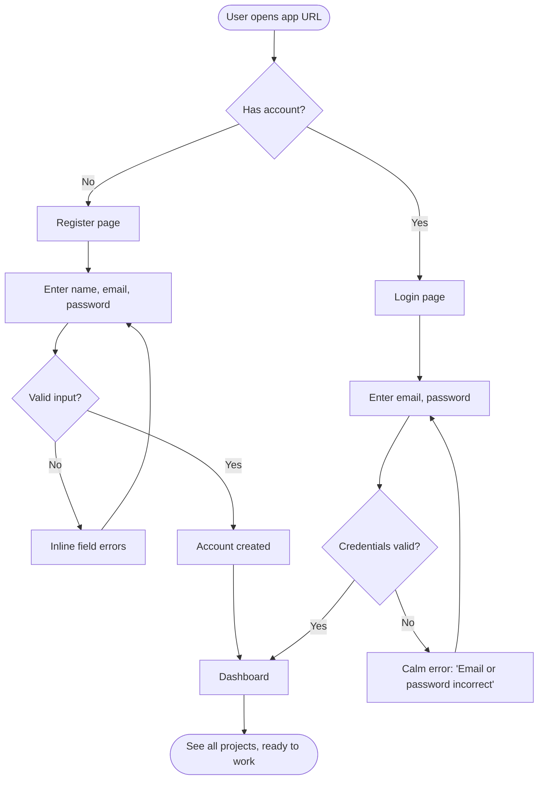
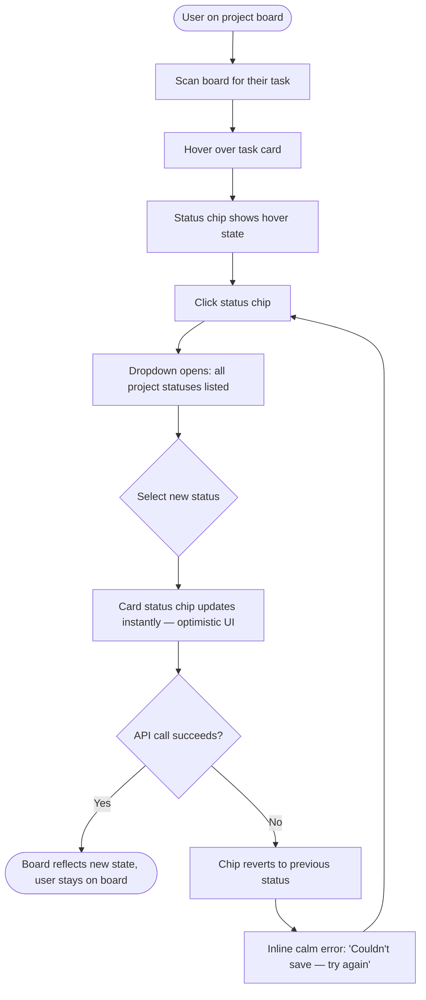
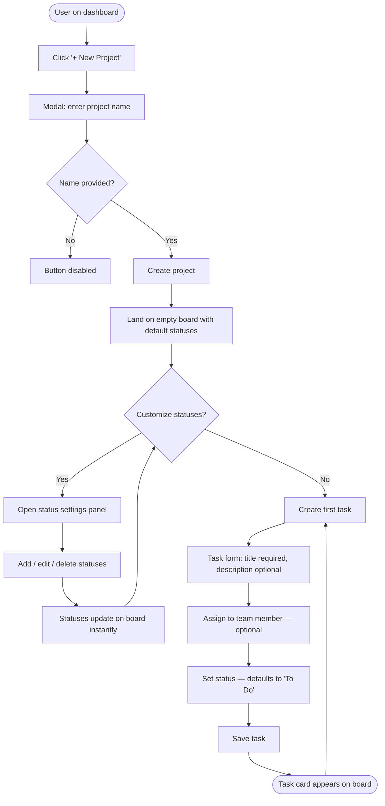
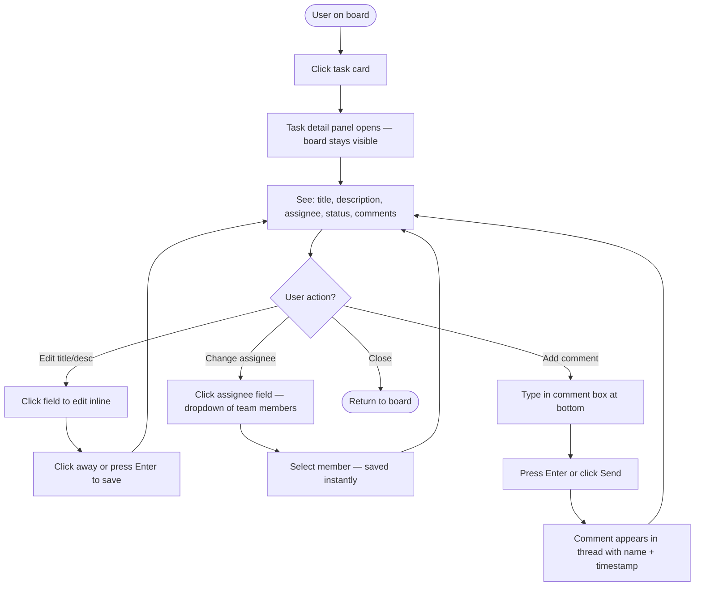
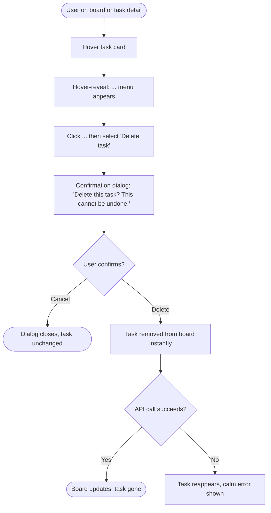

# UX Design Specification - bmad-tutorial-1

**Author:** Diyor
**Date:** 2026-04-03

---

## Executive Summary

### Project Vision

A clean, immediately usable task tracking SPA for a fixed team of 5–7 people. No onboarding friction, no enterprise complexity — the UI should feel transparent, not trained. Every screen should communicate state clearly so team members know what's happening without asking.

### Target Users

A single user type: **team members** (flat hierarchy, equal permissions). Technical comfort level is assumed to be average — comfortable with web apps, not expecting power-user features. They use the tool on desktop browsers during work hours. Primary goal: know what's mine, know what's happening, update it quickly.

### Key Design Challenges

- **Task board clarity** — the board view is the core screen. It must show status, assignee, and task name at a glance without becoming cluttered as tasks accumulate.
- **Custom status flexibility** — statuses are per-project and user-defined. The UI must make creating/editing statuses feel lightweight, not like a settings deep-dive.
- **Safe destructive actions** — deletion of projects and tasks must be protected without making the UI feel paranoid (one confirmation dialog, not multi-step).

### Design Opportunities

- **Zero-friction onboarding** — self-registration lands directly on the dashboard with existing projects visible. First experience should feel like joining a living workspace, not starting from scratch.
- **Board as the home** — the task board per project can be the dominant mental model. If users think "board first", navigation becomes obvious.
- **Minimal chrome** — no sidebars of sidebars, no nested settings. A clean nav + content area pattern keeps focus on the work.

## Core User Experience

### Defining Experience

The defining interaction is **task status updates** — the most frequent daily action. Every design decision should optimize for this loop: open the board → find your task → change its status → done. This loop must be completable in under 3 clicks with zero cognitive load.

### Platform Strategy

- Desktop web (SPA) — mouse and keyboard primary input
- No touch or mobile optimization required for v1
- Minimum viewport 1280px; layout tuned for task board density on standard monitors
- No offline functionality required

### Effortless Interactions

All three of the following must feel instant — no loading states, no modal chains, no confirmation friction unless destructive:

- **Opening a task** — click once, detail appears (inline panel or modal, not a new page)
- **Changing a status** — single click or dropdown directly on the task card; no form submission feel
- **Leaving a comment** — text field always visible on the task detail; submit with Enter or button

### Critical Success Moments

- **First board view** — team member lands on the project board and immediately understands who's doing what. If this takes more than 5 seconds to parse, the design has failed.
- **First status change** — must feel lighter than any tool they've used before. The moment it clicks without a page reload is the "this is better" moment.
- **First comment reply** — seeing a teammate's name on a comment thread makes the tool feel alive and collaborative.

### Experience Principles

1. **Status is king** — the board view is the product's center of gravity; every navigation decision should orient users back to it
2. **One click, one action** — status changes, assignments, and comments should never require more than one deliberate step
3. **No empty states that feel empty** — new projects should show default statuses immediately so the board never looks broken
4. **Speed is the feature** — perceived performance is a design deliverable, not just an engineering one

## Desired Emotional Response

### Primary Emotional Goals

Users should feel **focused and accomplished** after each session. The tool should create the sensation of clarity — you came in knowing what needed doing, you did it, you can see it's done. No lingering uncertainty about team state.

### Emotional Journey Mapping

| Stage | Desired Feeling |
|---|---|
| First registration | Welcome, oriented — "I can see what's going on" |
| Daily board check | Focused — "I know exactly what I need to do today" |
| After status update | Accomplished — "Progress is visible and recorded" |
| After commenting | Connected — "My team can see my thinking" |
| When something goes wrong | Calm, reassured — "It's okay, the app handled it" |
| Returning next session | Familiar, comfortable — "Everything is where I left it" |

### Micro-Emotions

- **Confidence, not confusion** — navigation and actions are always predictable
- **Trust, not skepticism** — data saves reliably; no fear of losing work
- **Accomplishment, not frustration** — task completion feels satisfying, not laborious
- **Calm, not anxiety** — the board shows full team state; nothing is hidden or ambiguous

### Design Implications

- **Focused** → Minimal visual noise; no unnecessary elements competing for attention; generous whitespace; clear typographic hierarchy
- **Accomplished** → Visible state changes when a task moves status (subtle animation or color shift confirms the action landed)
- **Calm reassurance on errors** → Errors use neutral tones (not red alarms), friendly language ("Couldn't save — try again"), and auto-dismiss when resolved
- **No anxiety** → The board always shows a complete picture; no "loading..." black holes; skeleton states over spinners

### Emotional Design Principles

1. **Clarity over cleverness** — every element earns its place by reducing confusion, not adding personality
2. **Acknowledge actions visibly** — users need to feel their clicks did something; state changes must be perceptible
3. **Errors are recoverable moments, not failures** — tone and color should never alarm; always tell users what to do next
4. **Familiarity builds trust** — consistent patterns across all screens so users never have to re-learn the interface

## UX Pattern Analysis & Inspiration

### Inspiring Products Analysis

**GitHub Issues/Projects**
- Status badges and assignee avatars communicate state at a glance with minimal space
- Hover-to-reveal action menus keep the list view clean until interaction is needed
- Inline editing — click a field, edit it, click away to save — no form submissions
- Clear open/closed state using color and iconography, not just text labels

**Notion**
- Minimal chrome: almost no toolbar visible unless you need it
- Content-first layout — the page is the thing, navigation is secondary
- Generous whitespace creates breathing room without wasting space
- Hover states reveal available actions without cluttering the default view

**Jira (what works)**
- Column-based board view is the established mental model for task tracking — don't reinvent this
- Task cards show exactly: title, assignee avatar, status — nothing more by default
- Clicking a card opens a detail panel without navigating away from the board

### Transferable UX Patterns

**Navigation Patterns**
- Persistent left sidebar for project list (GitHub/Notion style) — always know where you are
- Board as the default landing view per project, not a list or dashboard

**Interaction Patterns**
- Hover-to-reveal actions on task cards (edit, delete) — keeps the board clean
- Inline status change via dropdown on the card — no modal, no page nav
- Click-to-expand task detail as a side panel or modal — board stays visible underneath

**Visual Patterns**
- Color-coded status chips (small, consistent) — one color per status, not gradients
- Assignee avatar on card instead of full name — saves space, still clear
- Whitespace as a design tool — don't fill every pixel

### Anti-Patterns to Avoid

- **Jira's nested settings menus** — custom statuses should be accessible in 1–2 clicks, not buried
- **Notion's blank canvas for first-timers** — always pre-populate default statuses so the board never looks broken on first open
- **GitHub's label overload** — for v1, status is the only visual tag on a card; don't add label systems

### Design Inspiration Strategy

**Adopt:**
- Column board view (Jira's concept, not its execution)
- Hover-reveal actions (GitHub/Notion)
- Inline status change on the card (GitHub issues)

**Adapt:**
- Notion's minimal chrome → apply to nav and header; keep the board area as content-dominant
- GitHub's avatar-based assignee display → use on cards and filter bar

**Avoid:**
- Any pattern that requires navigating away from the board to complete a task action
- Deep settings hierarchies for status management

## Design System Foundation

### Design System Choice

**Tailwind CSS + shadcn/ui** — utility-first styling with a library of accessible, unstyled-by-default components that the team owns and can modify freely.

### Rationale for Selection

- **Minimal aesthetic fit** — Tailwind's utility approach produces clean, purposeful UIs without fighting against opinionated defaults
- **Ownership** — shadcn/ui components are copied into the codebase, not imported from a package; full control, no version lock-in
- **Accessibility built-in** — shadcn/ui is built on Radix UI primitives, providing keyboard navigation and ARIA support out of the box
- **Team scale** — ideal for a small dev team; no design system maintenance overhead
- **Inspiration alignment** — Notion and Linear (the inspiration benchmarks) both use Tailwind-style minimal design language

### Implementation Approach

- Use shadcn/ui for core components: buttons, dropdowns, modals, inputs, tooltips, badges
- Use Tailwind for layout, spacing, typography, and color application
- Define a small set of design tokens (colors, font sizes, spacing scale) as Tailwind config values
- No component framework with its own design language (no MUI, no Ant Design)

### Customization Strategy

- **Color palette:** Neutral base (gray scale) + one accent color for interactive elements and status highlights; avoid loud multi-color palettes
- **Status colors:** Each status gets one assigned color chip — defined at project creation or defaulted; 5–6 max distinct colors
- **Typography:** Single sans-serif font (e.g. Inter); 3 sizes max for body/label/heading
- **Spacing:** 4px base unit via Tailwind; consistent padding/margin across all components

## Defining Core Experience

### Defining Experience

**"Update a task's status directly on the board."**

This is the interaction that defines the product. If a team member can scan the board, spot their task, click the status chip, pick the new status, and see the card update — all without leaving the board view — the product has delivered its core value. Everything else supports this loop.

### User Mental Model

Users arrive with a Kanban mental model (from Jira/Trello): columns = statuses, cards = tasks. This is an established, well-understood pattern — we don't need to teach it. The opportunity is to execute it faster and with less friction than what they've used before.

**What frustrates them with existing tools:**
- Jira requires opening a task detail to change status
- Too many clicks to do the most common action
- Page navigations that break the board context

**Our approach:** Status change happens inline on the card, board context never lost.

### Success Criteria

- Status change completes in 1 click + 1 selection (2 interactions max)
- No page reload or navigation — board stays in view throughout
- The card reflects the new status within 200ms (optimistic UI update)
- User never needs to open the task detail just to change status

### Novel vs. Established Patterns

**Established:** Column-based board view — no need to innovate here; users know it.

**Our twist:** Inline status dropdown on the card itself (not just drag-and-drop between columns). This means:
- Status change works even if the board has many columns and drag targets are small
- Works cleanly with keyboard users
- No accidental drops or reordering issues

### Experience Mechanics

**1. Initiation**
User sees a task card on the board. The status chip (colored badge) is always visible on the card. It has a subtle hover state indicating it's interactive.

**2. Interaction**
User clicks the status chip → dropdown appears listing all project statuses → user selects the new status.

**3. Feedback**
The card's status chip updates immediately (optimistic UI). A subtle color transition confirms the change. If the API call fails, the chip reverts and a calm inline error appears ("Couldn't save — try again").

**4. Completion**
The card now shows the new status. Board column grouping updates if using column view. No navigation occurred. User is exactly where they were.

## Visual Design Foundation

### Color System

**Base Palette — Zinc Neutral Scale (Tailwind)**

A neutral gray-zinc base keeps the UI calm and content-focused. No warm or cool color bias — purely neutral so status colors stand out clearly.

| Role | Color | Tailwind Token |
|---|---|---|
| Background | Near-white | `zinc-50` |
| Surface (cards, panels) | White | `white` |
| Border | Subtle gray | `zinc-200` |
| Text primary | Near-black | `zinc-900` |
| Text secondary | Medium gray | `zinc-500` |
| Interactive accent | Indigo | `indigo-600` |
| Hover accent | Darker indigo | `indigo-700` |

**Status Color Palette (per project, up to 6)**

Default status colors shipped out of the box:

| Default Status | Color | Tailwind Token |
|---|---|---|
| To Do | Gray | `zinc-400` |
| In Progress | Blue | `blue-500` |
| In Review | Amber | `amber-500` |
| Blocked | Red | `red-500` |
| Done | Green | `green-500` |

**Semantic Colors**

| Role | Color |
|---|---|
| Success | `green-500` |
| Error / Destructive | `red-500` (muted, not alarming) |
| Warning | `amber-500` |
| Info | `blue-500` |

### Typography System

**Font:** Inter (variable) — neutral, highly legible, matches GitHub/Notion aesthetic perfectly. Available via Google Fonts or bundled.

| Level | Size | Weight | Usage |
|---|---|---|---|
| Heading | 20px / 1.25rem | 600 | Page titles, project names |
| Subheading | 16px / 1rem | 500 | Section labels, card titles |
| Body | 14px / 0.875rem | 400 | Task descriptions, comments |
| Label | 12px / 0.75rem | 500 | Status chips, metadata, timestamps |

Line height: 1.5 for body; 1.2 for headings. Letter spacing: default for all levels.

### Spacing & Layout Foundation

**Base unit:** 4px. All spacing values are multiples of 4.

| Use | Value |
|---|---|
| Card padding | 12px (3 units) |
| Section gap | 24px (6 units) |
| Board column gap | 16px (4 units) |
| Sidebar width | 240px |
| Card min-width | 280px |
| Content max-width | 1440px |

**Layout structure:** Fixed left sidebar (project list) + main content area (board/task view). No top navbar competing with the sidebar. Clean two-column split.

### Accessibility Considerations

- All text on `zinc-50` background meets WCAG AA contrast (zinc-900 text: 15:1 ratio)
- Interactive accent `indigo-600` on white meets AA for large text; buttons use white text on indigo for full compliance
- Status chips use both color AND text label — never color alone
- Focus rings enabled via Tailwind's `ring` utilities for keyboard navigation
- Minimum tap/click target: 32px height for all interactive elements

## Design Direction Decision

### Design Directions Explored

- **Direction 1 — Clean Split:** Fixed 220px labeled sidebar + board. Familiar and predictable, but sidebar consumes horizontal space.
- **Direction 2 — Top Nav:** Horizontal navigation bar + breadcrumb. Maximum board width, but top bar adds vertical competition.
- **Direction 3 — Focus Wide:** 56px icon-only sidebar + full-width board. Maximum content area, minimum chrome.

### Chosen Direction

**Direction 3 — Focus Wide**

Icon-only sidebar (56px) for navigation, project name as the header's primary element, board occupying the full remaining viewport. Assignee filter bar sits directly above the board — no toolbars competing with content.

### Design Rationale

- Delivers the most board real estate — every pixel goes to the work, not the UI shell
- Aligns with "status is king" principle: the board is the dominant experience
- Matches the minimal aesthetic of GitHub and Notion without copying either directly
- Icon sidebar is learnable in a single session for a 5–7 person team; familiarity builds quickly
- Removes all redundant navigation layers — one sidebar, one header, one toolbar

### Implementation Approach

- Left: 56px dark sidebar (`zinc-900`) with icon buttons, active state in `indigo-600`
- Header: project name (dropdown for switching) + action buttons flush right
- Toolbar: assignee filter chips + board/list toggle — no other controls
- Board: `zinc-50` background, card columns with `zinc-100` column backgrounds
- Cards: white surface, status badge + assignee avatar always visible

## User Journey Flows

### Flow 1: Authentication (Register & Login)

**UX notes:**
- No email verification for v1 — straight to dashboard on register
- Error messages appear inline under the field, not as top-level banners
- "Forgot password" deferred to post-MVP

---

### Flow 2: Task Status Update (Defining Experience)

**UX notes:**
- Board never navigates away — user stays in full board context
- Status dropdown lists statuses in creation order
- Optimistic UI update before API response for perceived speed

---

### Flow 3: Project Setup (Create → Configure → Populate)

**UX notes:**
- Default statuses: To Do, In Progress, In Review, Done — pre-populated on creation
- Status settings panel is accessible from the header (⚙ icon), not buried in nested menus
- Task form is a side panel or modal — board remains visible underneath

---

### Flow 4: Task Detail & Commenting

**UX notes:**
- Task detail opens as a right-side panel, not a new page — board columns remain visible on the left
- All edits save on blur/Enter — no explicit Save button needed
- Comment thread is chronological, newest at bottom

---

### Flow 5: Destructive Action (Delete with Confirmation)

**UX notes:**
- ... menu only appears on hover — keeps cards clean by default
- Confirmation dialog uses neutral language and color — not alarming red header
- Same pattern applies to project deletion from project settings

---

### Journey Patterns

- **Navigation:** Board is always the home base — all actions return to it
- **Hover-reveal:** Destructive/secondary actions only appear on hover, never by default
- **Optimistic UI:** Status changes and task saves update the UI before API confirmation
- **Inline editing:** Click-to-edit fields, save on blur — no modal forms for edits

### Flow Optimization Principles

1. Every flow returns the user to the board — no dead ends in new pages
2. Errors are inline and calm — never full-page or alarming
3. Required fields are minimal — only task title is mandatory
4. Destructive actions require one confirmation step, not multiple

## Component Strategy

### Design System Components (shadcn/ui — available out of the box)

| Component | Used For |
|---|---|
| `Button` | Primary actions (Create, Save), secondary (Cancel), destructive (Delete) |
| `Input` | Task title, description, project name, auth fields |
| `DropdownMenu` | Status selector, assignee selector, task ··· actions menu |
| `Dialog` | Create task modal, create project modal, delete confirmation |
| `Badge` | Status chips (with color override per status) |
| `Avatar` | Team member initials display on cards and filter bar |
| `Tooltip` | Icon sidebar button labels |
| `Separator` | Section dividers in task detail panel |
| `Form` + `Label` | All form fields with validation |
| `Skeleton` | Loading states for board and card lists |

### Custom Components

**TaskCard**
- **Purpose:** Displays a task on the board; the most-seen component in the product
- **Anatomy:** Title (subheading weight) + status chip (bottom-left) + assignee avatar (bottom-right)
- **States:** Default, hover (shows ··· menu), loading (skeleton), done (reduced opacity)
- **Interactions:** Click → opens TaskDetailPanel; hover ··· → DropdownMenu (Edit, Delete); click status chip → StatusChip dropdown
- **Accessibility:** `role="button"`, keyboard focusable, status conveyed via text + color

**StatusChip**
- **Purpose:** Inline clickable badge for viewing and changing task status
- **Anatomy:** Colored dot + status label text; on click becomes DropdownMenu of all project statuses
- **States:** Default, hover (cursor pointer + subtle border), open (dropdown visible), updating (brief opacity pulse)
- **Behavior:** Optimistic UI — updates immediately on select, reverts on API failure
- **Accessibility:** `aria-label="Change status"`, keyboard operable via Enter/Space

**BoardColumn**
- **Purpose:** A status column on the task board
- **Anatomy:** Column header (status name + task count) + scrollable card list + "Add task" ghost button at bottom
- **States:** Default, empty (shows "No tasks" message), drop target (post-MVP)
- **Variants:** Min-width 240px; adjustable via Tailwind

**TaskDetailPanel**
- **Purpose:** Right-side sliding panel for full task detail; board stays visible
- **Anatomy:** Header (title + close button) + metadata row (assignee, status) + description field + divider + CommentThread
- **States:** Open (slides in from right, 400px wide), closed (not rendered)
- **Interactions:** All fields click-to-edit inline; closes on X or Escape key

**CommentThread**
- **Purpose:** Chronological comment list + input for new comments
- **Anatomy:** List of comments (avatar + name + timestamp + text) + text input + Send button
- **States:** Empty ("Be the first to comment"), populated, submitting (input disabled briefly)
- **Interactions:** Enter to submit, Shift+Enter for new line

**AppSidebar**
- **Purpose:** 56px icon-only navigation sidebar (Direction 3)
- **Anatomy:** Logo icon at top + nav icon buttons (Board, Projects, Team) + Settings icon at bottom
- **States:** Default, hover, active (indigo highlight) per button
- **Accessibility:** `aria-label` + Tooltip on every icon button

**AssigneeFilterBar**
- **Purpose:** Chip-based filter row above the board for filtering tasks by assignee
- **Anatomy:** "Filter by:" label + "All" chip + one chip per team member
- **States:** All (default), one member selected (indigo highlight)
- **Interactions:** Click chip to filter; click again or All to clear

### Component Implementation Strategy

- All custom components built with Tailwind utility classes + shadcn/ui primitives
- No component has its own CSS file — styles via className only
- Components co-located with their feature (e.g. `components/board/TaskCard.tsx`)
- Shared design tokens defined in `tailwind.config.ts`

### Implementation Roadmap

**Phase 1 — Core (required for MVP launch)**
- StatusChip, TaskCard, BoardColumn — board cannot function without these
- TaskDetailPanel, CommentThread — required for task detail + comments (FR25–27)
- AppSidebar, AssigneeFilterBar — required for navigation + assignee filter (FR29)

**Phase 2 — Supporting (complete the MVP)**
- ConfirmDialog (pre-configured shadcn Dialog) — required for FR10, FR15
- All shadcn/ui form components configured with project design tokens

## UX Consistency Patterns

### Button Hierarchy

| Variant | Usage | Appearance |
|---|---|---|
| **Primary** | Main action per screen (Create, Save, Submit) | `indigo-600` bg, white text |
| **Secondary** | Supporting actions (Cancel, Edit) | White bg, `zinc-300` border, `zinc-700` text |
| **Destructive** | Delete actions | White bg, `red-500` border, `red-600` text — only after hover-reveal |
| **Ghost** | Low-priority actions (+ Add task, + Add status) | No bg, no border, `zinc-500` text, underline on hover |

**Rules:**
- One primary button per view — never two competing primary actions
- Destructive buttons never appear by default — always behind hover-reveal or confirmation step
- Button width: fit-content, minimum 80px; never full-width except on auth forms

### Feedback Patterns

**Success**
- Inline confirmation via state change (card updates, chip changes color) — no toast needed
- For form submits: dialog closes and new item appears — no separate success message

**Error**
- Inline under the offending field for form validation: `zinc-500` text, 12px, no red background
- For API failures: calm inline message near the failed action ("Couldn't save — try again"), auto-dismisses after 4s
- Never full-page error states; always allow user to stay and retry

**Loading**
- Skeleton screens for initial board and task list load (`zinc-200` animated shimmer)
- Buttons show spinner inside on submit; remain disabled until resolved
- No full-page spinners

**Empty States**
- Never truly blank — always show a helpful prompt
- Empty board: "No tasks yet — add your first task" with ghost button
- Empty project list: "Create your first project to get started" with primary button

### Form Patterns

- **Required fields:** Task title only; placeholder reads "Title (required)" — no asterisk clutter
- **Validation:** On blur, not on every keystroke
- **Submit:** Enter key submits single-field forms; multi-field forms use explicit button
- **Cancel:** Always available; discards without confirmation
- **Field labels:** Above the field, never placeholder-only

### Navigation Patterns

- **Active state:** Current page icon in AppSidebar highlighted in `indigo-600`
- **Project switching:** Click project name in header → dropdown of all projects → instant navigation
- **Back navigation:** No back button — closing TaskDetailPanel returns to board
- **Deep linking:** Each project board has a unique URL; task detail panels addressable via URL hash

### Modal & Overlay Patterns

- **Create modals** (project, task): Centered dialog, max-width 480px, Escape to cancel
- **Confirm dialogs**: Centered dialog, max-width 400px, neutral tone, destructive button right, Cancel left
- **Task detail panel**: Right-side slide-in (not modal) — board remains interactive underneath
- **Backdrop:** `zinc-900/20` overlay; click outside closes non-destructive dialogs only

### Hover-Reveal Pattern

- Secondary and destructive card actions (··· menu) only appear on `mouseenter`
- Reveal is instant — `opacity: 0 → 1` transition, no delay
- Keyboard users: Tab to card → actions accessible via keyboard menu, not hover-dependent

## Responsive Design & Accessibility

### Responsive Design

**Scope: Desktop-only for v1**

This is an internal team tool used at desks. No mobile or tablet breakpoints are required.

| Constraint | Decision |
|---|---|
| Minimum supported viewport | 1280px wide |
| Mobile breakpoints | Not required |
| Tablet breakpoints | Not required |
| Layout behavior | Fluid — board columns expand to fill available width |
| Overflow behavior | Horizontal scroll if board columns exceed viewport |

**Layout at minimum viewport (1280px):**
- Sidebar: 56px fixed
- Remaining canvas: 1224px — sufficient for 4–5 board columns
- Board columns: `min-width: 240px`, grow equally via flex
- Task detail panel: 400px right-side drawer — board remains visible and scrollable

### Accessibility

**Scope: Standard usable UI — no WCAG compliance required for v1**

| Area | Requirement |
|---|---|
| Color contrast | Minimum 4.5:1 for body text (`zinc-800` on white passes by default) |
| Labels | All form inputs have visible `<label>` elements above the field |
| Keyboard navigation | All interactive elements reachable via Tab, operable via Enter/Space |
| Focus indicators | `focus-visible:ring-2 ring-indigo-500` applied to all interactive elements |
| Click targets | Minimum 32px height on all buttons and interactive controls |
| Status chips | Color is supplementary — status name always shown as text, never color-only |
| Destructive actions | Confirmation dialog: Enter confirms, Escape cancels |
| Semantic HTML | `<button>`, `<nav>`, `<main>`, `<dialog>` used throughout |

**Deferred to v2:**
- ARIA live regions for optimistic UI updates
- Full screen reader audit
- High-contrast mode support
- `prefers-reduced-motion` media query

**Note:** Most accessibility defaults are handled by shadcn/ui components (Radix UI primitives) — keyboard navigation, focus management, and ARIA roles come out of the box for Dialog, DropdownMenu, and interactive components.
